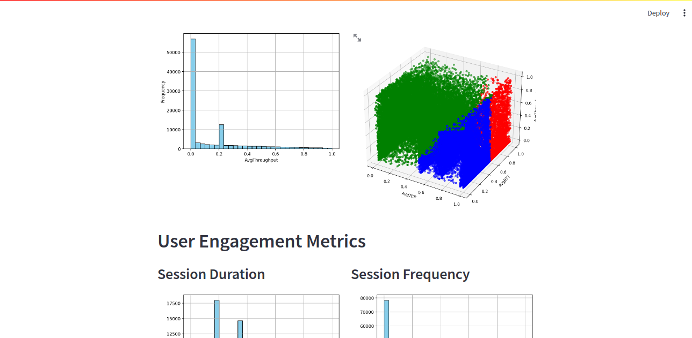

# Telecom Analytics Project

## Overview

This project focuses on analyzing user engagement, experience, and satisfaction in the telecommunications industry. Leveraging a dataset containing various network and device metrics, we aim to provide actionable insights for business growth and decision-making.

## Project Structure

- **/dashboard**: Streamlit frontend for visualizations.
- **/data**: Store the dataset and any additional data files.
- **/models**: Save machine learning models.
- **/notebooks**: Jupyter notebooks for exploratory data analysis (EDA) and modeling.
- **/scripts**: Python scripts for data processing and analysis.
- **/tests**: Unit tests for project components.

## Getting Started

1. **Clone the Repository:**
   ```bash
   git clone https://github.com/yourusername/telecom-analytics.git
   cd telecom-analytics

## Dependencies
- Python 3.x
- Pandas, NumPy, Matplotlib, Seaborn for data manipulation and visualization.
- Streamlit for building the dashboard.
- Scikit-learn for machine learning tasks.
- SQLAlchemy for database interaction

## Dashboard




